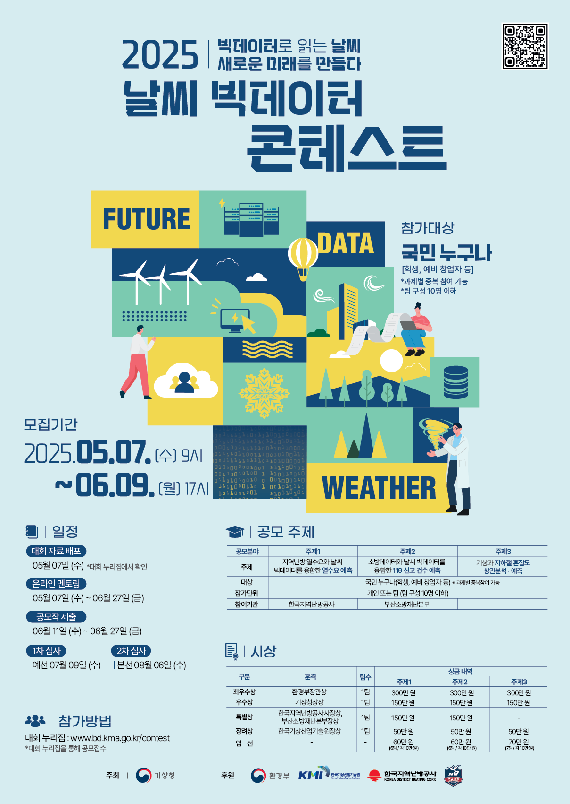

# 2025 Weather Big Data Contest

**KMA Weather Big Data Contest 2025**

> **Award:** Excellence Award — *Administrator of the Korea Meteorological Administration (KMA)*
> **Prize:** 1,000,000 KRW

---

## 📌 Overview

* **Host:** Korea Meteorological Administration (KMA)
* **Period:** May 7, 2025 – Aug 6, 2025
* **Team:** 4 members

  * Backend Developer
  * Embedded Systems Developer
  * Atmospheric Science Researcher
  * Data Analyst (my role)

### 🎯 Objective

To analyze the relationship between weather conditions and public-transport congestion and build a **predictive model** capable of forecasting congestion levels by time and location.

---

## 🛠 Project Details

### 1. Data Cleaning

* Removed pandemic-era data due to abnormal behavioral patterns, significantly improving model stability.
* Applied domain-driven rules to clean outliers, missing values, and irregular time-series segments.

### 2. External Data Collection & Enrichment

* Collected **high-impact event data** that consistently affects public-transport congestion:

  * Professional baseball league schedules
  * Football (soccer) league schedules
  * Stadium geolocation mapping to nearby routes/stations
* Integrated weather data, congestion metrics, and event data into a unified modeling dataset.

### 3. Report & Presentation

* Authored the analytical sections of the final report and contributed to the team’s presentation to KMA reviewers.
* Led the data acquisition, preprocessing, and feature engineering components of the project.

---

## 📈 Key Contributions

1. **Event-Driven Hypothesis Testing**

   * Designed external features based on recurring sports events
   * Verified impact via cross-correlation and temporal analysis

2. **End-to-End Data Fusion Pipeline**

   * Built the merged feature table combining weather, transport, and event data
   * Personally handled the majority of scraping, cleaning, and integration tasks

3. **Improved Predictive Performance**

   * Pandemic-period exclusion and enriched external variables led to measurable performance gains versus baseline models

---

## 🏆 Results

* **Excellence Award (2nd Prize)**
* **Presented by the Administrator of the Korea Meteorological Administration**

---

## 📎 Reference Image

